# Computer Vision People Detector

---


---

## Author: Juan Carlos González
## Email: jcgi.laboral@gmail.com

---

## Date: November, 2023

---

## Content

1. Objective
2. Project development
- Stage 1: Theoretical Understanding of YOLOv5 and Machine Vision
- Stage 2: Preparation of the Work Environment
- Stage 3: Data Acquisition and Preprocessing
- Stage 4: Training the Model
- Stage 5: Implementation in a Practical Application
3. Conclusion
4. References

---


## Convolutional neural networks
The hidden layers of the **convolutional neural networks** perform specific mathematical functions, such as synthesis or filtering, called convolutions. They are very useful for image classification because they can extract relevant features from images that are useful for image recognition and classification. The new form is easier to process without losing features that are critical to making a good prediction. Each hidden layer extracts and processes different features of the image, such as edges, color, and depth.


## Machine Vision

Computer vision is the ability of computers to extract information and knowledge from images and videos. With neural networks, computers can distinguish and recognize images in a similar way to humans. Machine vision has several applications, such as:

- Visual recognition in autonomous vehicles so they can recognize road signs and other road users
- Content power to automatically remove unsafe or inappropriate content from image and video files
- Facial recognition to identify faces and recognize attributes such as open eyes, glasses, and facial hair
- Image labeling to identify brand logos, clothing, safety equipment, and other image details


## How does computer vision work?

Computer vision needs a lot of data. It runs data analysis over and over again until it identifies differences and eventually recognizes images.

For example, to train a computer to recognize car tires, it needs to be fed large amounts of tire images and tire-related items to learn the differences and recognize a tire, especially one without defects.

Two essential technologies are used to achieve this: a type of machine learning called deep learning and a convolutional neural network (CNN).

ML uses algorithmic models that allow a computer to teach itself about the context of visual data. If enough data is fed through the model, the computer will "observe" the data and teach it to differentiate one image from another. Algorithms allow the machine to learn on its own, rather than having someone program it to recognize an image.

A CNN helps a machine learning or deep learning model "see" by dividing images into pixels that are assigned labels or labels. It uses tags to perform convolutions (a mathematical operation on two functions to produce a third function) and makes predictions about what it is "seeing."

The neural network executes convolutions and verifies the accuracy of its predictions in a series of iterations until the predictions begin to come true. It will then recognize or view images in a human-like manner.

Like a human distinguishing an image from a distance, a CNN first discerns solid edges and simple shapes, then fills in the information while running iterations of its predictions.

A CNN is used to understand individual images. A recurrent neural network (RNN) is similarly used for video applications to help computers understand how images in a series of frames relate to each other.


---

# 2. Objective

Develop an artificial vision system for object detection using the YOLO (You Only Look Once) version 5 neural network. This system will be designed to identify and locate specific objects (people, smartphones, cars) in real-time video, thus demonstrating the capacity of deep learning in computer vision tasks.

## 2.1 Development of the Objective

Based on the **_Objetivo of Proyecto_**,  it is proposed to carry out the following **Stages of the Artificial Vision Project with YOLOv5**.

## Stage 1: Theoretical Understanding of YOLOv5 and Machine Vision
- **Objective**: To acquire a solid knowledge about the principles of artificial vision and specifically about the architecture and operation of YOLOv5.
- **Activities**: 
- Study relevant resources, academic articles, and technical documentation on neural networks.
- Focus on YOLOv5 and its predecessors.

## Stage 2: Preparation of the Work Environment
- **Objective**: Configure the development environment and the necessary tools for the project.
- **Activities**: 
- Install the necessary software (such as Python, PyTorch, YOLO V5 computer vision libraries).
- Set up a development environment (Google Collab).
- Ensure access to adequate hardware (GPUs for efficient training).

## Stage 3: Data Acquisition and Preprocessing
- **Objective**: Collect and prepare a suitable dataset to train and validate the model.
- **Activities**: 
- Select and download relevant datasets.
- Perform image tagging if necessary.
- Normalize and possibly augment data to improve model generalization.

## Stage 4: Training the Model
- **Objective**: Train the YOLOv5 network with the prepared dataset.
- **Activities**: 
- Configure the training parameters (learning rate, number of epochs).
- Perform model training.
- Monitor progress to ensure convergence.

## Stage 5: Implementation in a Practical Application
- **Objective**: Develop an application or interface to demonstrate the functionality of the model.
- **Activities**: 
- Create an application (desktop software).
- Use the model to detect objects in real time.

**Note**: Each of these stages is crucial to the success of the project and will provide hands-on and comprehensive experience in developing machine vision systems with advanced Machine Learning technologies.

--- 

# Stage 1: Theoretical Understanding of YOLOv5

YOLOv5 🚀 is a state-of-the-art system, which uses a convolutional neural network for real-time object detection, which Ultralytics represents in its open-source research.

<div align="center">

<a href="https://ultralytics.com/yolov5" target="_blank">
</a>
</div>

## How the YOLOv5 Neural Network works

The neural network divides the image into regions, predicting identification and probability boxes for each region; The boxes are weighted from the predicted probabilities. The algorithm learns generalizable representations of objects, allowing for low detection error for new entries, different from the training dataset. The base algorithm runs at 45 frames per second (FPS) without batch processing on a Titan X GPU; A fast version of the algorithm runs at over 150 fps. Due to its processing characteristics, the algorithm is used in object detection applications in video transmission with a signal fragment of less than 25 milliseconds.


## Architecture

The model was implemented as a convolutional neural network and was evaluated in the PASCAL VOC detection dataset. The initial convolutional layers of the network are responsible for the extraction of features from the image, while the full connection layers predict the probability of output and the coordinates of the object. The network has 24 convolutional layers followed by 2 layers of full connection; This makes use of 1x1 reduction layers followed by 3x3 convolutional layers. The Fast YOLO model makes use of a 9-layer neural network. The final output of the 7x7x30 prediction tensor model.


## Training

For pre-training, the first 20 convolutional layers are used followed by a group averaging layer and a complete connection layer; then the resulting model is converted to obtain object detection. For the object detection implementation, 4 convolutional layers and 2 full connection layers with randomly initialized weights are added. The last layer of the network predicts probabilities of classes and coordinates for the identification boxes; For this step, the height and width of the identification box is normalized with respect to the image parameters, so that its values are kept between 0 and 1. In the last layer a trigger function is used, using a square-sum error for output optimization.


## Limitations

The algorithm delimits strong spatial constraints on the boundaries of the prediction box since each cell predicts only two boxes and one class; This limits the number of objects that can be detected, which makes the algorithm limited in detecting objects presented in groups.

## YOLO Versions

- YOLO (2015)
- YOLO9000 (2016)
- YOLOv2 (2017)
- Fast YOLO (2017)
- YOLOv3 (2018)
- YOLOv4 (April 2020)
- **YOLOv5 (2020)**
- YOLOR (2021)
- YOLOv6 (2022)
- YOLOv7 (2022)
- YOLOv8 (2023)

YOLO, YOLO9000, YOLOv2 and YOLOv3, YOLOv5 and YOLOv8 belong to the same author, the academics from the University of Washington, who formed the company Ultrlytics. But YOLO is not a registered trademark, there is doubt about the significance of the use of the name by other authors, such as in YOLOv4, YOLOR and YOLOv7, developed by academics from the Taiwanese Academia Sinica. Finally, YOLOv6 was developed by the Chinese delivery company Meituan for its own autonomous robots.

## YOLO V5

YOLOv5 (You Only Look Once, version 5) is the fifth iteration of the famous YOLO series of object detection algorithms. Developed by Ultralytics, YOLOv5 represents a significant advancement in real-time object detection thanks to its improved accuracy and speed.

## Key Features of YOLOv5

- **Speed and Accuracy**: YOLOv5 offers an optimal combination of speed and accuracy, making it suitable for real-time applications.
- **Improved Architecture**: Incorporates improvements in the neural network architecture to increase efficiency and accuracy.
- **Simplified Implementation**: Uses PyTorch, making it easy to deploy and custom training.
- **Compatibility with Various Model Sizes**: Available in various sizes (YOLOv5s, YOLOv5m, YOLOv5l, YOLOv5x), allowing it to be used on a variety of devices, from embedded systems to powerful servers.

## How YOLOv5 works

YOLOv5 processes an entire image in a single assessment, allowing it to detect objects in real time. Here are the key aspects of how it works:

- **Image Splitting**: The image is divided into a grid, and for each cell in the grid, the model predicts bounding boxes and class probabilities.
- **Using Anchors**: Use anchors or anchors (predefined bounding boxes) to improve accuracy in object detection.
- **Post-processing**: Apply techniques such as non-maximum suppression to refine detection boxes.


## YOLOv5 Training

- **Data Preparation**: Requires a dataset labeled with bounding boxes and object classes.
- **Transfer Learning**: Allows you to use pre-trained models to speed up training and improve accuracy on specific datasets.
- **Hyperparameter Optimization**: Allows you to adjust hyperparameters such as learning rate and batch size to suit different needs.

## YOLOv5 Apps

- **Video Surveillance**: Detection of people, vehicles and other objects in real time.
- **Automotive**: Pedestrian and obstacle detection in autonomous driving systems.
- **Social Media Analysis**: Automatic recognition of objects in images and videos.
- **Health**: Analysis of medical images to identify pathologies.

## Limitations and Challenges

- **Group Detection**: Difficulties in detecting small objects or when they are grouped together.
- Generalization: May require fine-tuning for very specific or uncommon datasets.
- **Resource Requirements**: Larger models need powerful hardware, especially for training.

## YOLOv5 Versions

- YOLOv5s: The smallest and fastest version, suitable for devices with limited resources.
- YOLOv5m: Medium-sized version, balance between speed and precision.
- YOLOv5l: Large version, greater precision at the cost of speed.
- YOLOv5x: The larger, more accurate version, ideal for applications where accuracy is critical.

In short, YOLOv5 is a powerful tool in the field of object detection, offering exceptional performance that makes it suitable for a wide range of practical applications.

More information: [Drone-Computer Communication Based Tomato Generative Organ Counting Model Using YOLO V5 and Deep-Sort](https://www.researchgate.net/publication/362894109_Drone-Computer_Communication_Based_Tomato_Generative_Organ_Counting_Model_Using_YOLO_V5_and_Deep-Sort?_tp=eyJjb250ZXh0Ijp7ImZpcnN0UGFnZSI6Il9kaXJlY3QiLCJwYWdlIjoiX2RpcmVjdCJ9fQ)

--- 

---

## Stage 2: Preparation of the Work Environment

At this stage, the work environment will be prepared using Google Colab and configuring the file 'coco128.yaml', necessary for our object detection project with YOLOv5.

### Using Google Colab

Google Colab is a free cloud-based service that allows you to run Jupyter notebooks without the need for local configuration and with access to free GPUs. 

#### Steps to Set Up Google Colab:

1. **Access Google Colab from the YoloV5 repository to **: 

- Sign in with a Google account.

<p></p>
    
 - Access [Yolo V5](https://github.com/ultralytics/yolov5).

<p></p>
    
 - Select the section in the training section [Train Custom Data](https://docs.ultralytics.com/yolov5/tutorials/train_custom_data)
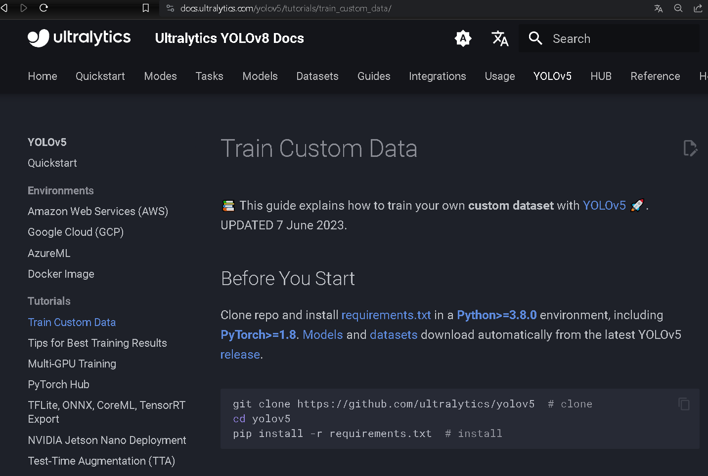
<p></p>
   
  
2. **Creating a New Notebook**: 
- Go to the 'Environments' > 'Notebooks' section.
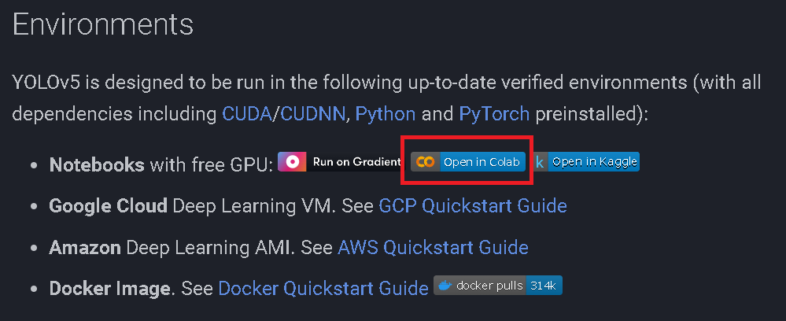
<p></p>
   
- A new notebook will open in the browser.
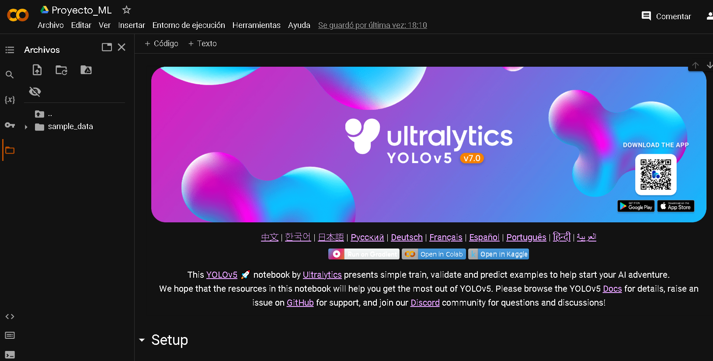
<p></p>

3. **Enable GPU**:
- Go to 'Edit' > 'Notebook Settings'.
- Select 'GPU' in the hardware accelerator.
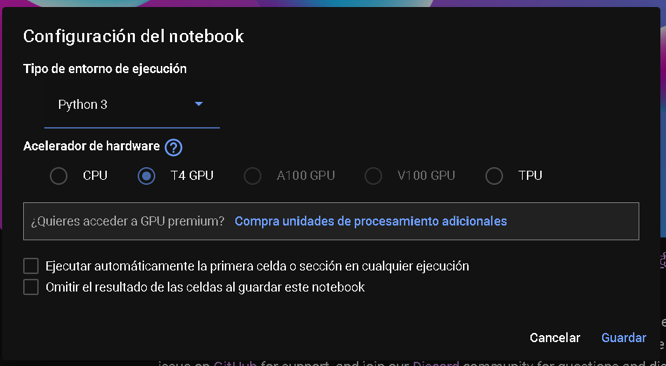
<p></p>

---

--- 

4. **Install the libraries**:
- Run the code block to:
- Clone the YOLO V5 repository.
- Install the torch and utils libraries. 
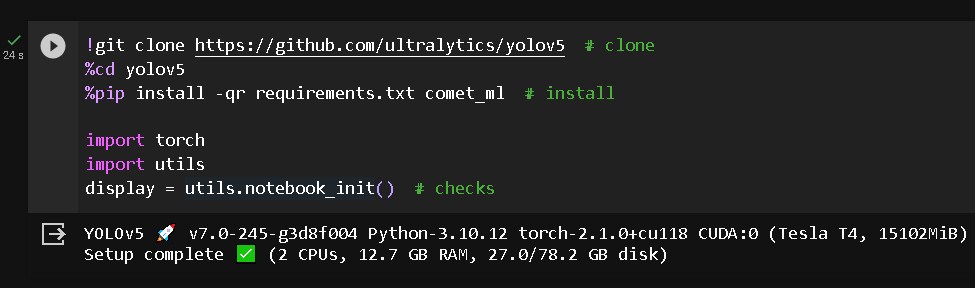
<p></p>

Clone GitHub [repository](https://github.com/ultralytics/yolov5), install [dependencies](https://github.com/ultralytics/yolov5/blob/master/requirements.txt) and check PyTorch and GPU.

---

```python
!git clone https://github.com/ultralytics/yolov5 #clone
%cd yolov5
%pip install -qr requirements.txt comet_ml # install

import torch
import utils
display = utils.notebook_init() # checks
```

--- 
5. **Configure 'coco128.yaml'**:
- The YOLO v5 repository has been cloned: 
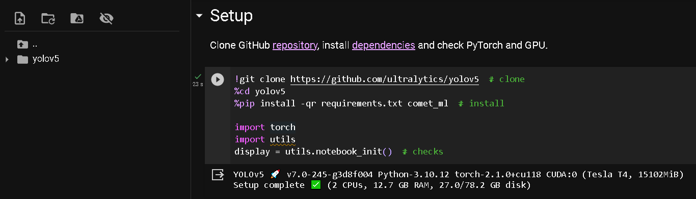
<p></p>

6. **Access the YOLOv5 Directory**:
- Explore the 'coco128.yaml' File:
- The file is located in the '/data' directory within the repository.
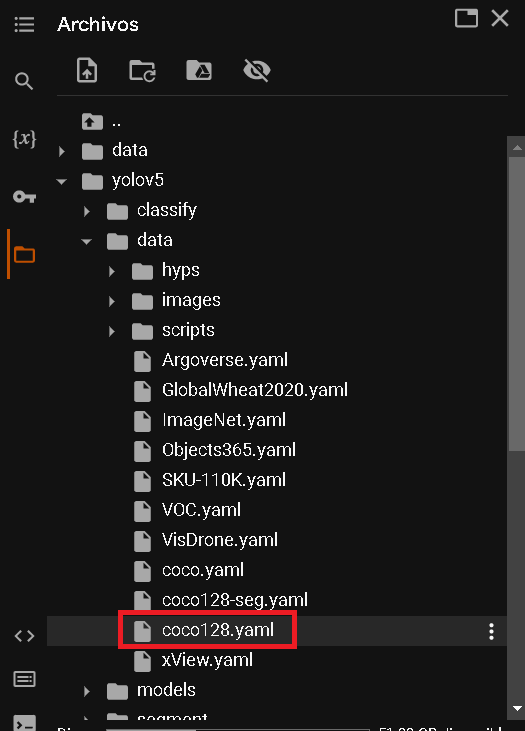
<p></p>

7. **Modify the 'coco128.yaml' file** (if necessary):
- Open the file in the text editor.
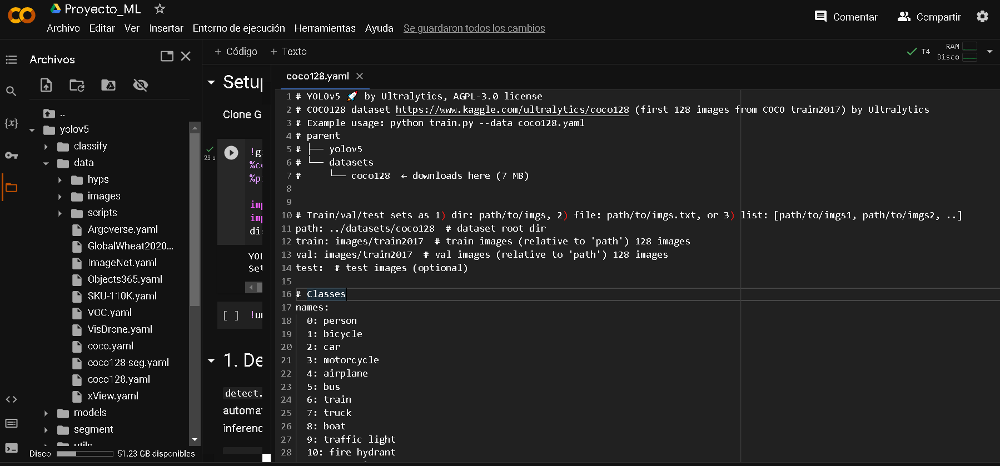
<p></p>
- Make necessary changes, such as adjusting the paths of the training data 
- Modify the data classes to be labeled.
   
```yaml
train: /content/data/images/train # training image path
val: /content/data/images/val # validation image path
test: # test images (optional)
   
# Classes
names:
0: person
1: cell phone
   
# Download script/URL (optional)
Download: https://ultralytics.com/assets/coco128.zip
```
<p></p>
<p></p>
<p></p>
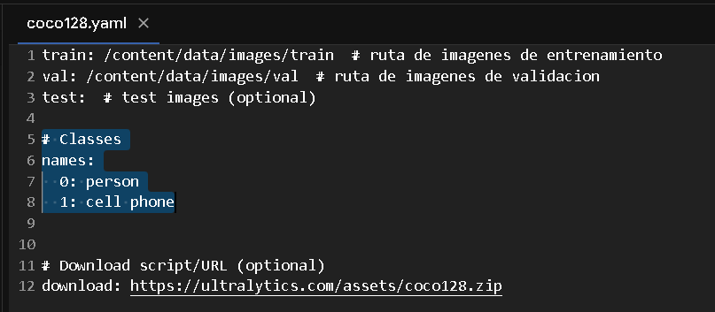
<p></p>
   

8. **Save Changes**:
 - Save the file with the name **custom.yaml** and close the file after making the changes.
<p></p>
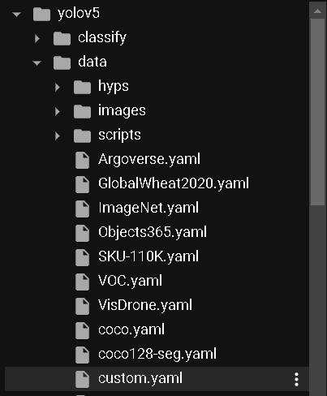
<p></p>
   

With these steps, you establish a work environment in Google Colab with access to powerful computing resources and configure the 'coco128.yaml' file, which is essential for initial training with YOLOv5.

--- 

---
## Stage 3: Image Acquisition and Tagging

Collect and label a set of images to train and validate the model.

### Collecting Images

1. **Collect images from the internet**: 

- Select and download image sets
-People
<p></p>
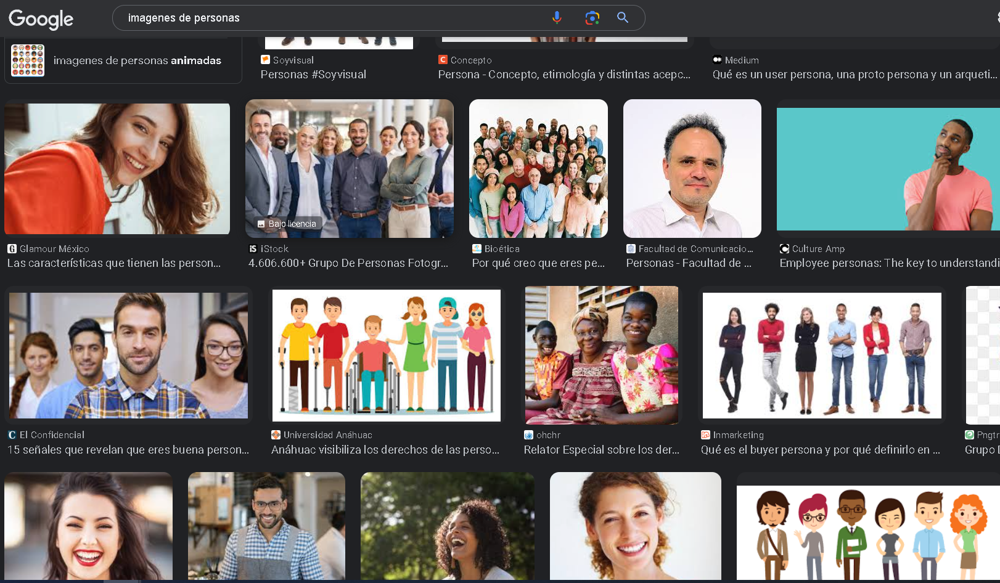
<p></p>
- Smart Phone
<p></p>
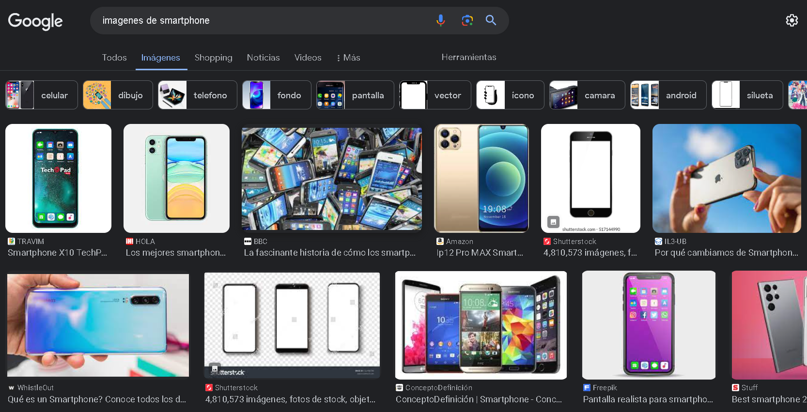
<p></p>
<p></p>
<p></p>
**Note**: 
- The set of images for training on a path called **_/data/images/train_**.
- The set of images for validation in a path called **_/data/images/val_** 
<p></p>
<p></p>

### Tagging Images

2. **Tagging images**: 

 - Perform image tagging for training and validation from [Makesense](https://www.makesense.ai/).
-Enter
<p></p>
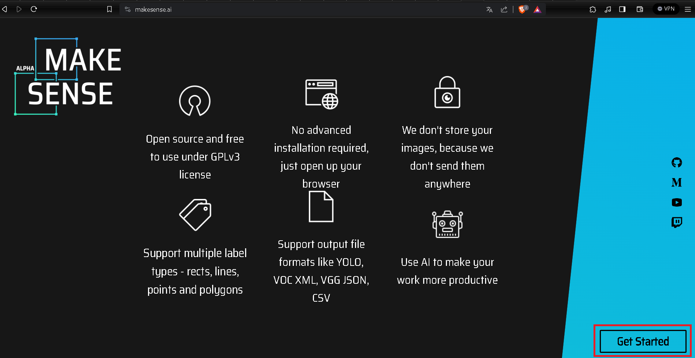
<p></p>
- Upload Images (Training)
<p></p>
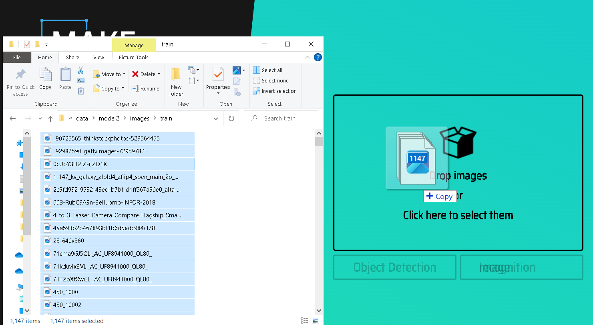
<p></p>
- Upload Images (Validation)
<p></p>
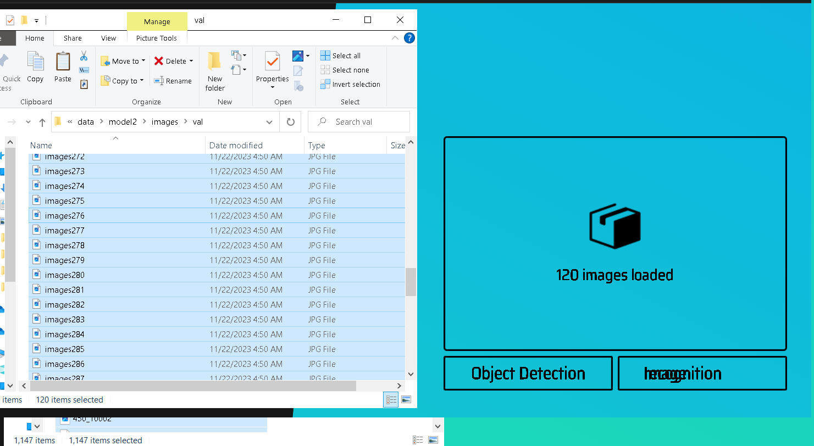
<p></p>
 
- Select the option **_Object detection_** 
<p></p>

<p></p> 
- Create tags (0: person, 1: cell phone)
<p></p>
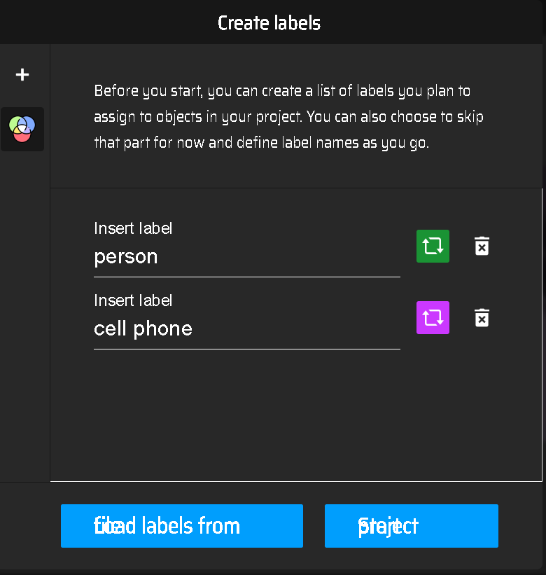
<p></p>
- Tagging Images (Training)
<p></p>
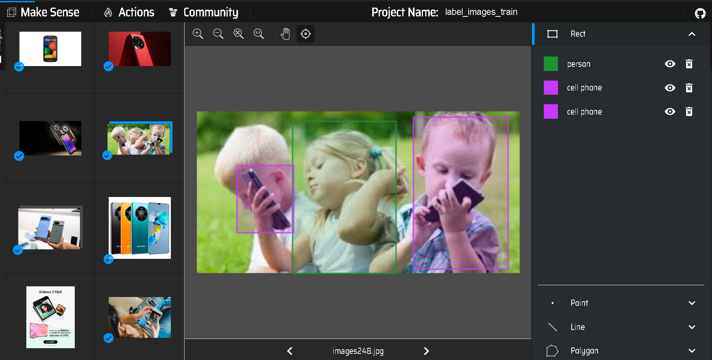
<p></p>
- Tagging Images (Validation)
<p></p>
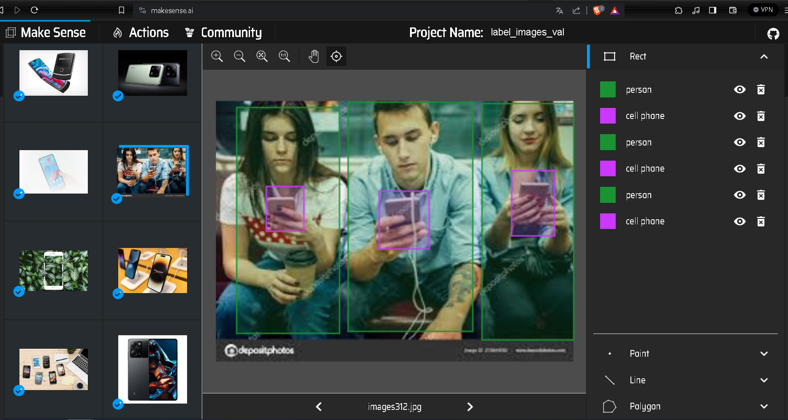
<p></p>
3. **Download labels**: 
- Export Annotations
<p></p>
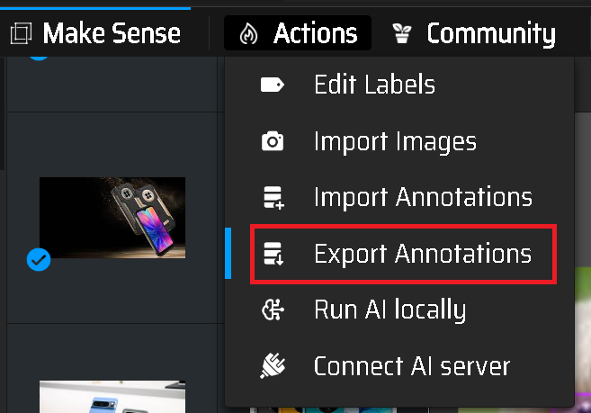
<p></p>
- Select in YOLO format
<p></p>
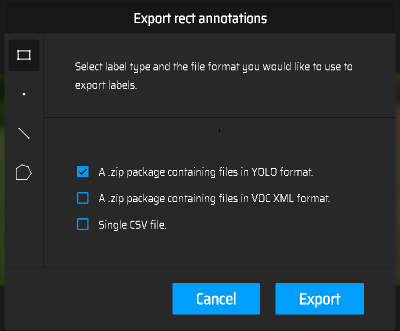
<p></p>
     
3. **Save tags**: 
     
<p></p>
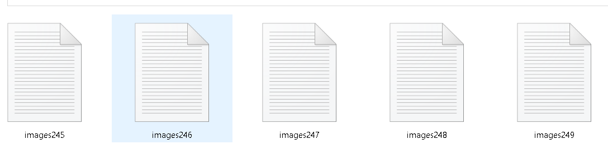
<p></p>
     
     
**Note**: 
- The set of labels for training on a path called **_/data/labels/train_**.
- The set of images for validation in a path called **_/data/labels/val_** 
<p></p>
<p></p>

3. **Compress training data set into a file called data.zip and upload it to the notebook in Google collab**: 
     
<p></p>
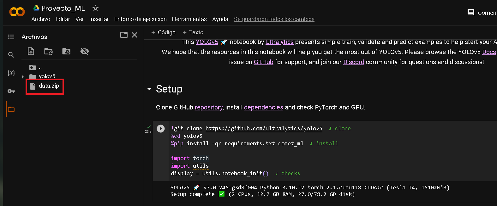
<p></p>
     
4. **Unzip the data with the following command**:
<p></p>
   
```bash
!unzip -q /content/data.zip -d /content/f greeting():
```
<p></p>
<p></p>
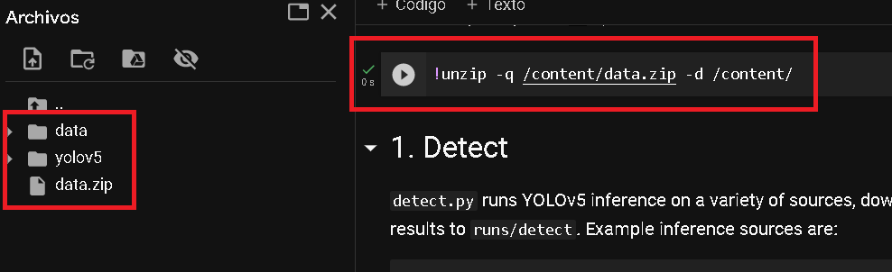
<p></p>

---

--- 

## Stage 4: Training the Model
Train the YOLOv5 network with the prepared dataset.

<p align=""><a href="https://bit.ly/ultralytics_hub"></a></p>
<br><br>

### Training parameters

1. **Configure the training parameters (learning rate, number of epochs).**: 

- Train the model with the following command:
<p></p>
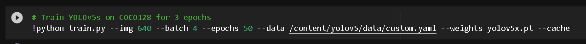
<p></p>
    
```python
!python train.py --img 640 --batch 4 --epochs 50 --data /content/yolov5/data/custom.yaml --weights yolov5x.pt --cache
```
2. **Describe the training parameters**: 

- !python train.py: This command executes the train.py script using Python. The ! is specific to Jupyter notebooks (such as Google Colab), and is used to execute shell commands.

- --img 640: Defines the size of the input image for the model. In this case, the images will be resized to 640x640 pixels. YOLOv5 uses square images, so a single number is provided.

- --batch 4: Set the batch size to 4. This means that the model will process 4 images at a time during training. The batch size is an important parameter that can affect the required memory and training speed.

- --epochs 50: Specifies the number of training epochs. An epoch represents a complete iteration over the entire training dataset. Here it is configured to train the model for 50 epochs.

- --data /content/yolov5/data/custom.yaml: Indicates the YAML file that contains the dataset settings. This file defines paths to the training and validation datasets, as well as the classes of objects to be detected. The custom.yaml file is located in the path /content/yolov5/data/, suggesting that a custom dataset is being used instead of the standard COCO128.

- --Weights yolov5x.pt: Select the starting weights for training. In this case, yolov5x.pt is being used, which corresponds to the "x" (extra large) variant of YOLOv5. This suggests that training starts with a pre-trained model on another (possibly larger or more complex) dataset and adapts to the current dataset.

- --cache: This argument indicates that images should be cached during the first training period. This can speed up subsequent epochs, as images do not need to be reloaded from disk.

---
3. Monitor progress to ensure convergence.
    
-Training
<p></p>
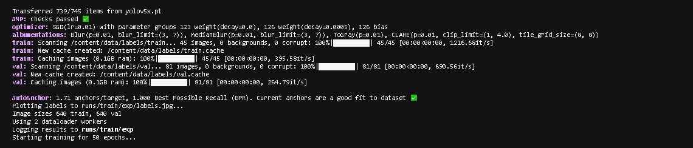
<p></p>
<p></p>
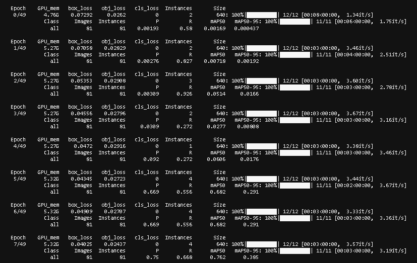
<p></p>
<p></p>

<p></p>
<p></p>
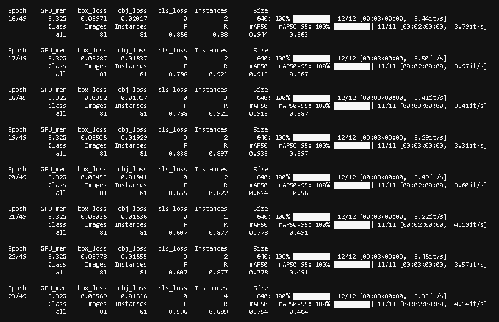
<p></p>
<p></p>
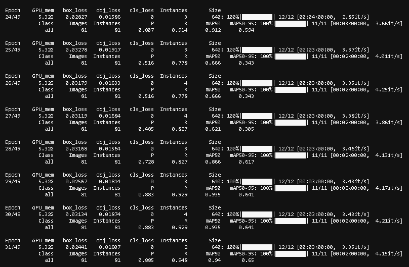
<p></p>
<p></p>
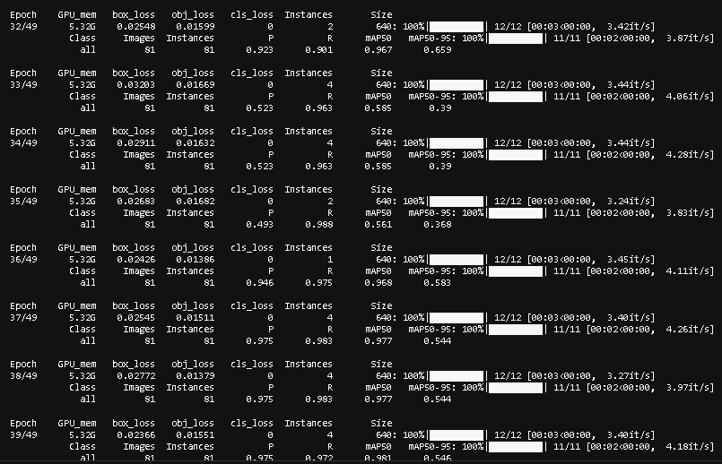
<p></p>
<p></p>
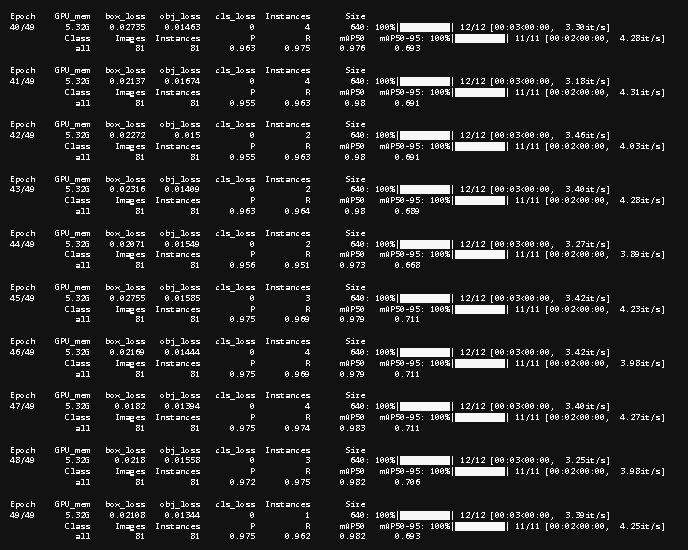
<p></p>
-Pesos
<p></p>
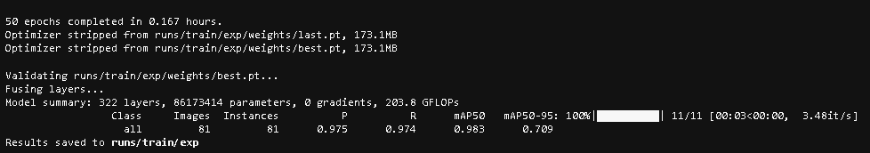
<p></p>
     
-Results
<p></p>
<p style="font-size:smaller;" >COMET INFO: ---------------------------------------------------------------------------------------
COMET INFO: Comet.ml OfflineExperiment Summary
COMET INFO: ---------------------------------------------------------------------------------------
COMET INFO: Data:
COMET INFO: display_summary_level : 1
COMET INFO: url : [OfflineExperiment will get URL after upload]
COMET INFO: Metrics [count] (min, max):
COMET INFO: loss [55] : (0.11667758971452713, 0.42063409090042114)
COMET INFO: metrics/mAP_0.5 [100] : (0.0016915127519639178, 0.9827929171016223)
COMET INFO: metrics/mAP_0.5:0.95 [100] : (0.00043652917895707356, 0.7108574717473164)
COMET INFO: metrics/precision [100] : (0.001934156378600823, 0.9754909936214834)
COMET INFO: metrics/recall [100] : (0.2716049382716049, 0.9876543209876543)
COMET INFO: train/box_loss [100] : (0.018203798681497574, 0.0729246437549591)
COMET INFO: train/cls_loss : 0.0
COMET INFO: train/obj_loss [100] : (0.013444976881146431, 0.029156703501939774)
COMET INFO: val/box_loss [100] : (0.007413851097226143, 0.0339466892182827)
COMET INFO: val/cls_loss : 0.0
COMET INFO: val/obj_loss [100] : (0.003477632999420166, 0.014706958085298538)
COMET INFO: x/lr0 [100] : (0.000496000000000000005, 0.0901)
COMET INFO: x/lr1 [100] : (0.00049600000000000005, 0.008416)
COMET INFO: x/lr2 [100] : (0.000496000000000000005, 0.008416)
COMET INFO: Others:
COMET INFO: Name : exp
COMET INFO: comet_log_batch_metrics : False
COMET INFO: comet_log_confusion_matrix : True
COMET INFO: comet_log_per_class_metrics : False
COMET INFO: comet_max_image_uploads : 100
COMET INFO: comet_mode : online
COMET INFO: comet_model_name : yolov5
COMET INFO: hasNestedParams : True
COMET INFO: offline_experiment : True
COMET INFO: Parameters:
COMET INFO: anchor_t : 4.0
COMET INFO: artifact_alias : latest
COMET INFO: batch_size : 4
COMET INFO: bbox_interval : -1
COMET INFO: box : 0.05
COMET INFO: bucket : 
COMET INFO: cfg : 
COMET INFO: cls : 0.0062500000000000001
COMET INFO: cls_pw : 1.0
COMET INFO: copy_paste : 0.0
COMET INFO: cos_lr : False
COMET INFO: degrees : 0.0
COMET INFO: device : 
COMET INFO: entity : None
COMET INFO: evolve : None
COMET INFO: exist_ok : False
COMET INFO: fl_gamma : 0.0
COMET INFO: fliplr : 0.5
COMET INFO: flipud : 0.0
COMET INFO: freeze : [0]
COMET INFO: hsv_h : 0.015
COMET INFO: hsv_s : 0.7
COMET INFO: hsv_v : 0.4
COMET INFO: hyp|anchor_t : 4.0
COMET INFO: hyp|box : 0.05
COMET INFO: hyp|cls : 0.5
COMET INFO: hyp|cls_pw : 1.0
COMET INFO: hyp|copy_paste : 0.0
COMET INFO: hyp|degrees : 0.0
COMET INFO: hyp|fl_gamma : 0.0
COMET INFO: hyp|fliplr : 0.5
COMET INFO: hyp|flipud : 0.0
COMET INFO: hyp|hsv_h : 0.015
COMET INFO: hyp|hsv_s : 0.7
COMET INFO: hyp|hsv_v : 0.4
COMET INFO: hyp|iou_t : 0.2
COMET INFO: hyp|lr0 : 0.01
COMET INFO: hyp|lrf : 0.01
COMET INFO: hyp|mixup : 0.0
COMET INFO: hyp|momentum : 0.937
COMET INFO: hyp|mosaic : 1.0
COMET INFO: hyp|obj : 1.0
COMET INFO: hyp|obj_pw : 1.0
COMET INFO: hyp|perspective : 0.0
COMET INFO: hyp|scale : 0.5
COMET INFO: hyp|shear : 0.0
COMET INFO: hyp|translate : 0.1
COMET INFO: hyp|warmup_bias_lr : 0.1
COMET INFO: hyp|warmup_epochs : 3.0
COMET INFO: hyp|warmup_momentum : 0.8
COMET INFO: hyp|weight_decay : 0.0005
COMET INFO: image_weights : False
COMET INFO: imgsz : 640
COMET INFO: iou_t : 0.2
COMET INFO: label_smoothing : 0.0
COMET INFO: local_rank : -1
COMET INFO: lr0 : 0.01
COMET INFO: lrf : 0.01
COMET INFO: mixup : 0.0
COMET INFO: momentum : 0.937
COMET INFO: mosaic : 1.0
COMET INFO: multi_scale : False
COMET INFO: name : exp
COMET INFO: noautoanchor : False
COMET INFO: noplots : False
COMET INFO: nosave : False
COMET INFO: noval : False
COMET INFO: obj : 1.0
COMET INFO: obj_pw : 1.0
COMET INFO: optimizer : SGD
COMET INFO: patience : 100
COMET INFO: perspective : 0.0
COMET INFO: project : runs/train
COMET INFO: quad : False
COMET INFO: rect : False
COMET INFO: resume : False
COMET INFO: save_dir : runs/train/exp
COMET INFO: save_period : -1
COMET INFO: scale : 0.5
COMET INFO: seed : 0
COMET INFO: shear : 0.0
COMET INFO: single_cls : False
COMET INFO: sync_bn : False
COMET INFO: translate : 0.1
COMET INFO: upload_dataset : False
COMET INFO: val_conf_threshold : 0.001
COMET INFO: val_iou_threshold : 0.6
COMET INFO: warmup_bias_lr : 0.1
COMET INFO: warmup_epochs : 3.0
COMET INFO: warmup_momentum : 0.8
COMET INFO: weight_decay : 0.0005
COMET INFO: workers : 8
COMET INFO: Uploads:
COMET INFO: asset : 13 (1.03 MB)
COMET INFO: confusion-matrix : 1
COMET INFO: environment details : 1
COMET INFO: git metadata : 1
COMET INFO: images : 6
COMET INFO: installed packages : 1
COMET INFO: model graph: 1
COMET INFO: os packages : 1
COMET INFO: 
COMET INFO: Still saving offline stats to messages file before program termination (may take up to 120 seconds)
COMET INFO: Starting saving the offline archive
COMET INFO: To upload this offline experiment, run:
comet upload /content/yolov5/.cometml-runs/e2d1e2a7ae8e4dbb91f1a666802d5448.zip</p>

<p></p>
**Note**: The weights indicated as best located in the route "**_runs/train/exp/weights/best.pt_**" are used.

---
---
4. **Display the training parameters**: 

- Display the performance graphs and training recognition with the following command:
<p></p>
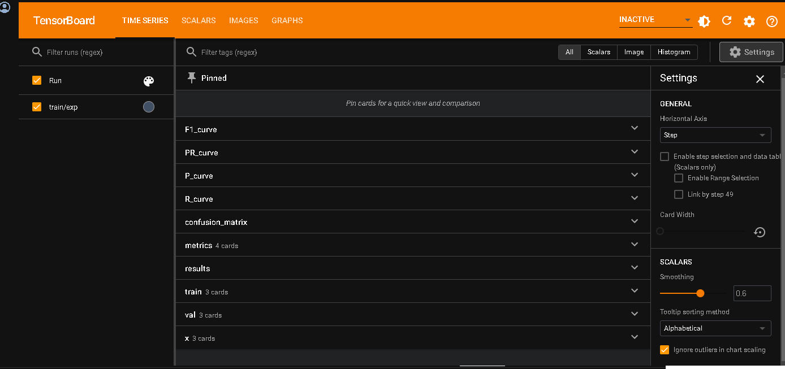
<p></p>
    
```bash
%load_ext tensorboard
%tensorboard --logdir runs
```
---

---
4. **Download the best trained weight**: 

 - Download the "**_best.pt_**" file:
<p></p>

<p></p>
    
```bash
from google.colab import files
files.download('./runs/train/exp/weights/best.pt')
```
---

--- 
## Stage 5: Implementation in a Practical Application

Develop an application or interface to demonstrate the functionality of the model.
  

1. **Environment Configuration**:
-Requirements: 
 - Install [Python == 3.9](https://www.python.org/downloads/release/python-3917/).
- Install PyTorch >= 1.8
```bash
pip install torch==1.8
```

2. **Create a Python Virtual Environment**:
```bash
Python -m VENV Detection
```
<p></p>
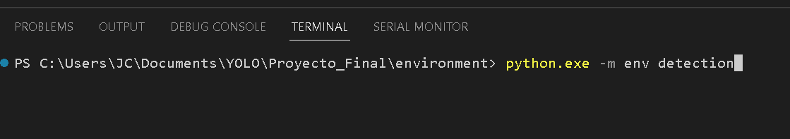
<p></p>
      
   
3. **Activate the Virtual Environment**: 
```bash
Activate
```
<p></p>
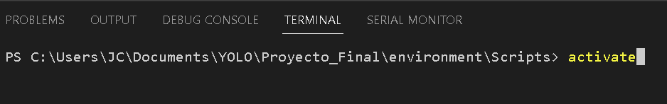
<p></p>
      
2. **Install Pytorch requirements**: 
    
```bash
pip install -r https://raw.githubusercontent.com/ultralytics/yolov5/master/requirements.txt
```
     
-Requirements: 
 - Install [Pytorch Requirements](https://docs.ultralytics.com/yolov5/tutorials/pytorch_hub_model_loading/).
<p></p>
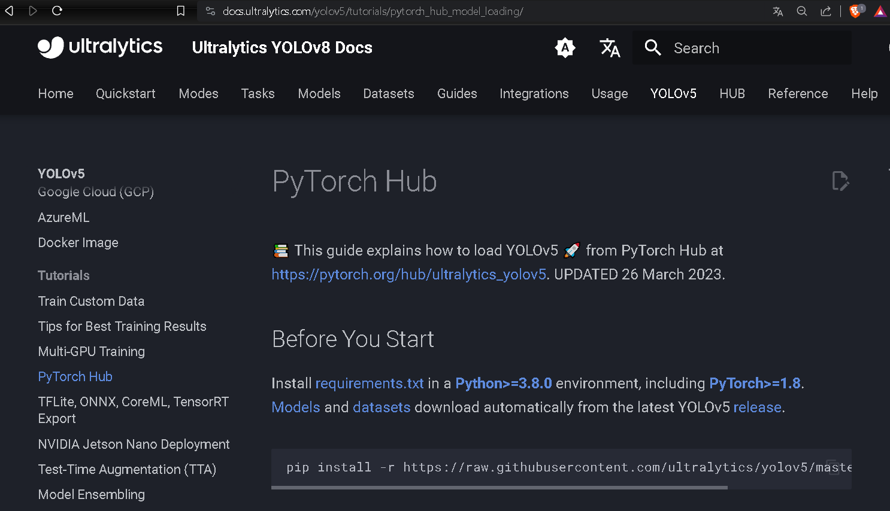
<p></p>
<p></p>
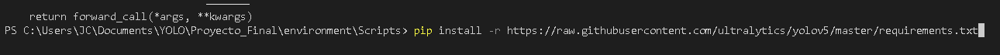
<p></p>
     
3. **Possible error**: 
    
- It is possible to give an error in the libraries so it is suggested to install
    
```bash
pip install daal==2021.4.0
```

**Create Object Detection Script**: 

- The script will detect.py load a trained model of YOLOv5 and activate the camera for object detection.

- detect.py Source Code
    
Import of necessary libraries
```python
import torch # Import PyTorch, used for neural network operations
import cv2 # Import OpenCV for image manipulation and processing
import numpy as np # Import NumPy for array/array management
```
Load the model from YOLOv5

- torch.hub.load loads a YOLOv5 model from the Ultralytics URL.

The 'custom' model and the file path of the pre-trained model are specified.
- model = torch.hub.load('ultralytics/yolov5', 'custom', path='D:/YOLO/Proyecto_Final/environment/Scripts/model/model2.pt')

Start video capture from webcam
```bash
CV2. VideoCapture(0) launches the default webcam on the system.
cap = cv2. VideoCapture(0)
```

Loop for continuous capture and detection
```python
while True:
cap.read() captures a frame of the webcam.
'ret' is a boolean that indicates whether the frame was captured correctly.
'frame' is the captured frame.
ret, frame = cap.read()
```

If the frame is not captured correctly, it displays an error message and continues
```python
if not ret:
print("Error capturing camera frame")
continue
```

Perform detection on the captured frame
The model processes the frame and returns the detections.
```python
detect = model(frame)
Get and display detection information
detect.pandas().xyxy[0] converts the results into a Pandas DataFrame.
info = detect.pandas().xyxy[0]
print(info)
```

Show the frame with detections
```python
cv2.imshow shows the window with the frame.
np.squeeze removes unit dimensions from the array.
detect.render() returns the frame with the drawn detections.
cv2.imshow('Car Detector', np.squeeze(detect.render()))
```

Wait for a key to be pressed to interrupt
```python
cv2.waitKey(5) waits 5 milliseconds.
If the 'Esc' key (ASCII code 27) is pressed, the loop breaks.
t = cv2.waitKey(5)
if t == 27:
break
```

Release the camera and close all windows
```bash
cap.release() releases the camera resource.
cv2.destroyAllWindows() closes all windows opened by OpenCV.
```

 4. **Run Script**:
```bash
python detect.py
```
<p></p>
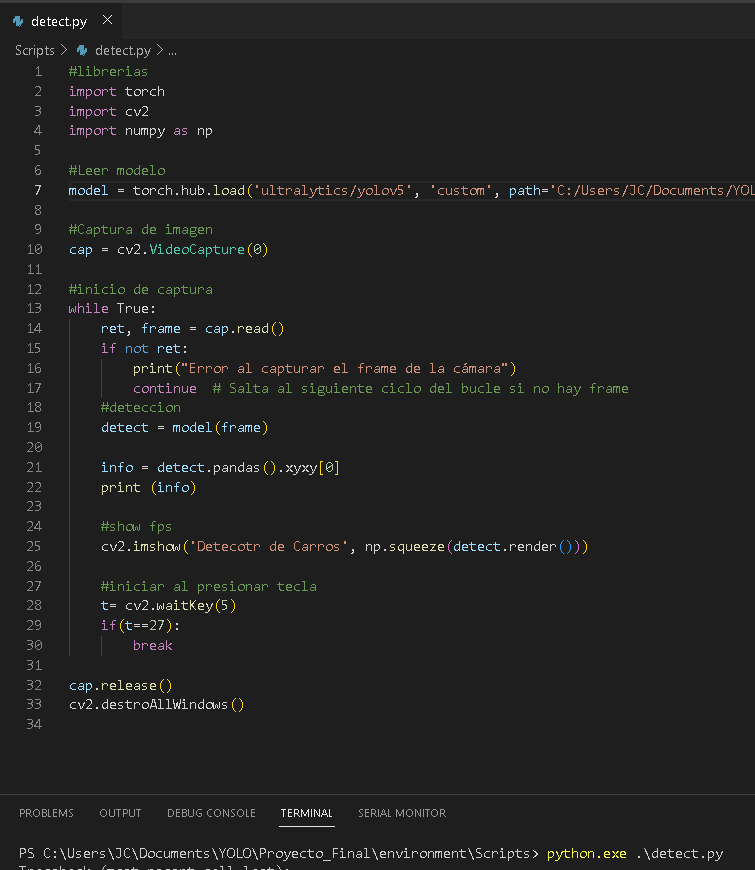
<p></p>
<p></p>
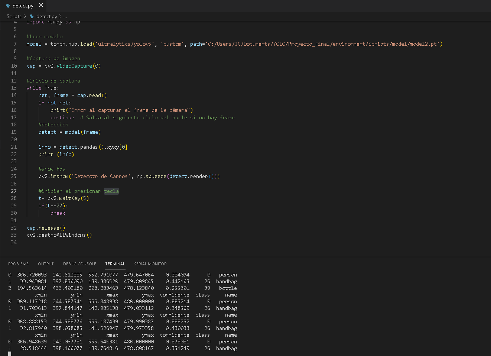
<p></p>

5. **Object Detection**:
<p></p>
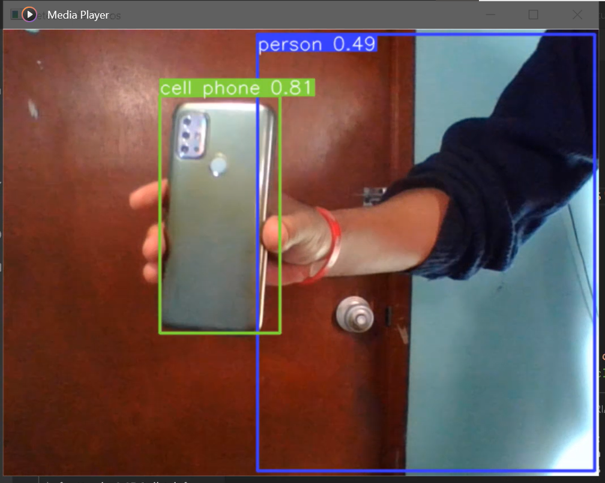
<p></p>
<p></p>
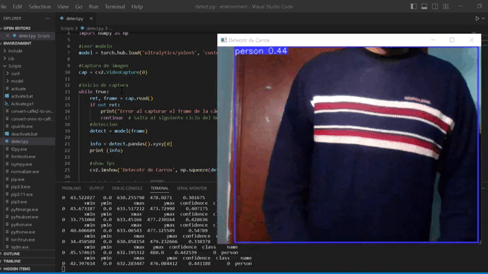
<p></p>
<p></p>

<p></p>

6. **Cart Detection Errors**:
<p></p>
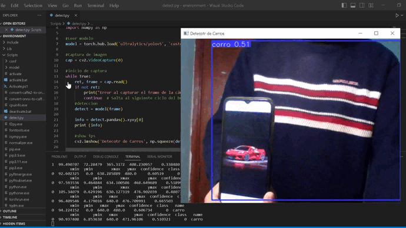
<p></p>
<p></p>

---

---

# 3. Conclusion

Throughout this project, YOLOv5 was implemented for object detection, focusing the analysis on two different models: one for the detection of people and smartphones, and the other for vehicles. This approach allowed to evaluate the versatility and effectiveness of YOLOv5 in different contexts and types of objects.

It was noted that YOLOv5, with its optimized architecture and ability to process images in real time, is highly effective in identifying and accurately locating specific objects within a dynamic environment. The model showed remarkable accuracy in detecting people and smartphones, which is crucial in applications such as security surveillance and consumer behavior analysis. On the other hand, vehicle detection had errors in detection, possibly due to the low number of images and/or greater training to obtain the ideal weights for detection.

The project also highlighted the importance of proper preprocessing of data and the selection of a representative training set. It became apparent that the performance of the model can be significantly improved by optimizing parameters and training with diversified data.

In conclusion, YOLOv5 presents itself as a powerful and flexible tool for object detection in multiple domains. However, it is critical to continue experimentation and fine-tuning to tailor models to specific needs and further improve their accuracy and efficiency.

---

# 4. References

- Jocher, Glenn, et al. "YOLOv5 Documentation." [YOLOv5](https://docs.ultralytics.com/yolov5/), Ultralytics, 2020.
- Redmon, Joseph, et al. "YOLOv3: An Incremental Improvement." [arXiv:1804.02767](https://arxiv.org/abs/1804.02767), 2018.
- Bochkovskiy, Alexey, et al. "YOLOv4: Optimal Speed and Accuracy of Object Detection." [arXiv:2004.10934](https://arxiv.org/abs/2004.10934), 2020.
- "PyTorch Documentation." [PyTorch](https://pytorch.org/docs/stable/index.html), PyTorch.
- Rosebrock, Adrian. "YOLO Object Detection with OpenCV." [PyImageSearch](https://www.pyimagesearch.com/2018/11/12/yolo-object-detection-with-opencv/), 2018.
- Howard, Andrew, et al. "MobileNets: Efficient Convolutional Neural Networks for Mobile Vision Applications." [arXiv:1704.04861](https://arxiv.org/abs/1704.04861), 2017.
- "Computer Vision - Object Detection with Deep Learning." [Coursera](https://www.coursera.org/learn/deep-learning-object-detection), Coursera.
- "Deep Learning for Computer Vision." [Udacity](https://www.udacity.com/course/deep-learning-nanodegree--nd101), Udacity.

---


